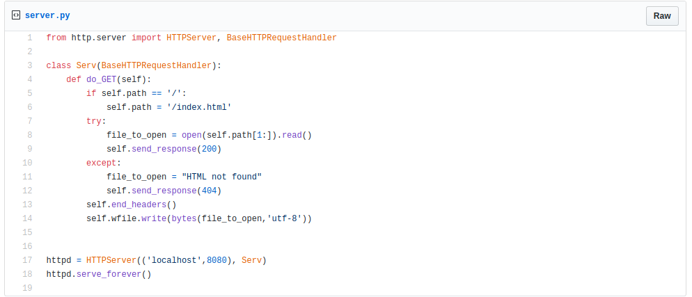

# A simple HTTP Server written in Python3 as a Systemd service

## Table of Contents

* Writing the server
* Writing the **HTML** file to serve
* Testing server
* Writing service file
* Enabling and starting the service
* Running tests
* What can go wrong?
* whoami

### Writing the server

This server is going to be a very simple HTTP server which we will use to host an HTML page with no functionalities but just something written inside it to let us know is we are up and running or not. There are no libraries that we need to install using *pip*, we will use a in-built library called **HTTPServer**. I've embedded the link to the code which is in the form of a gist that can be seen [here](https://gist.github.com/skr1p7/c6fd1d59b423ebcda59350504387e9a2). The code looks exactly like in the screenshot added below;



### Writing the HTML file to serve 

Create a new file called **index.html**. This is going to be a very basic HTML file with internal CSS to make the page look not very ugly. The link to the gist is attached [here](https://gist.github.com/skr1p7/06198bfd39573540661114071f84b03d) if you wish to simply copy the code. The screenshot attached below is as same as the script attached in the gist.


### Testing server

Let's quickly test if our server is able to serve our HTML file or not, run the following command:

```bash
$ python3 server.py
```
The output should look like this.


### Writing the service file

This is going to be the most **important** step as one single mistake here decides if you will be successful in writing your systemd service or not. 
Without wasting any more time, let's navigate to the **system** folder. Use the following command in your terminal:

```bash
$ cd /lib/systemd/system
```

Now we will use any text editor to create a the **.service** file. I choose **Vim** here. We will name our file **server.service**. Use the following command:

```bash
$ sudo vi server.service
```

Hit **I** to enter the **edit mode** in Vim so that you can start editing/writing in the file. Copy the lines as shown below in order to successfully create the **.service** file.

```
[Unit]
Description=Simple HTTPS Server Service
After=multi-user.target
Conflicts=getty@tty1.service

[Service]
Type=simple
ExecStart=/usr/bin/python3 /home/skr1p7/gci19/systemd_service/server.py
StandardInput=tty-force

[Install]
WantedBy=multi-user.target

```

In the **ExecStart** line, **/usr/bin/python3** points to the installation directory of Python3 and the **/home/skr1p7/gci19/systemd_service/server.py** points to the **server.py** file that we want to run as the systemd service. After copying the lines above, hit **Esc** key and the hit the **:** (colon) symbol so that you can write command to save and exit the file which is **wq** where **w** means save and **q** means quit. As soon as you save the file. Return back to the terminal.

### Enabling and starting the service

Up next we will reload the **systemctl daemon** as we have recently added a new service. Use the following command to do so:

```bash
$ sudo systemctl daemon-reload
```

Next we will enable the service, make sure that you remember the name of the service which in our case was **server.service**. Use the following command to do so;

```bash
$ sudo systemctl enable server.service
```

Afer enabling the servie, we will start the service using the following command:

```bash
$ sudo systemctl start server.service
```

### Running tests 

As we have successfully created the service, enabled and started it, now we will check the status to make sure that the service is up and running. Use the following command to do the same;

```bash
$ sudo systemctl status service.service
``` 
If the output looks something like this, congratulations! your service is up and running!


### What can go wrong?

Do make sure that you have navigated to the correct **system** directory as before fixing all the errors, I actually wrote the the **server.service** file in the ***/lib/systemd/** directory because of which I was getting this error:


I quickly went to see if there was any problems while saving the **server.service** file and I tried **ls** command inside the ***/lib/systemd/** again and that was a frustating moment, as you can see that I had seen two failures in the screenshot above as I noticed that the **server.service** file is sucessfully saved:


But then it didn't took much time to notice that out that I have saved the file in the wrong directory. So I moved it to the correct directory which was supposed to be **/lib/systemd/system** 

After running the service when I checked the status as decribed in the **Running tests** step, I again faced another error according to which my service was not running.


What was wrong here is that while testing my HTTP Server in the **Testing server** step, I forgot to quit the server. Make sure that you quit any initially running server. 

### whoami

Find me on [Twitter](https://twitter.com/0xskr1p7) and on [GitHub](https://github.com/skr1p7)

